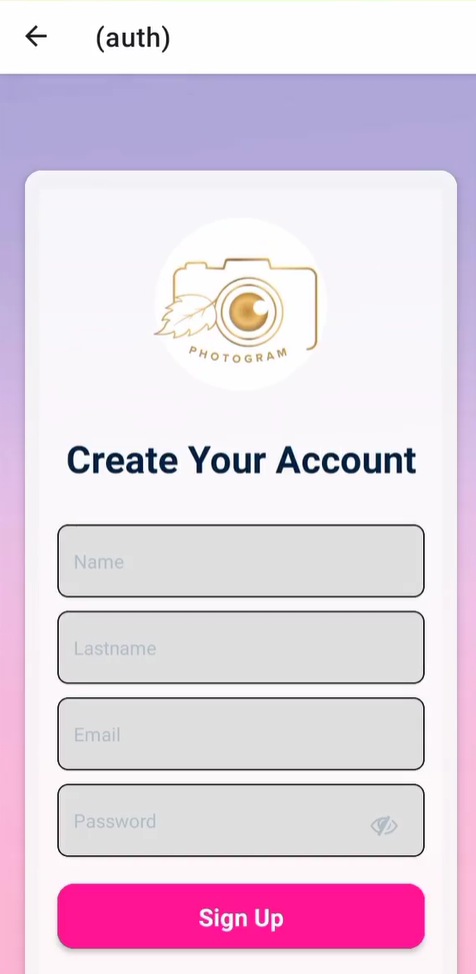
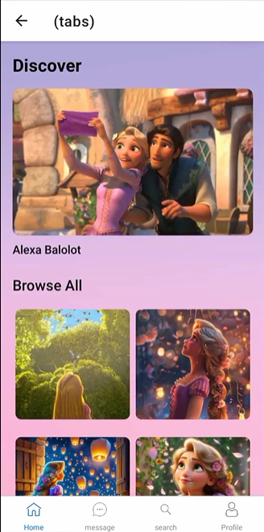
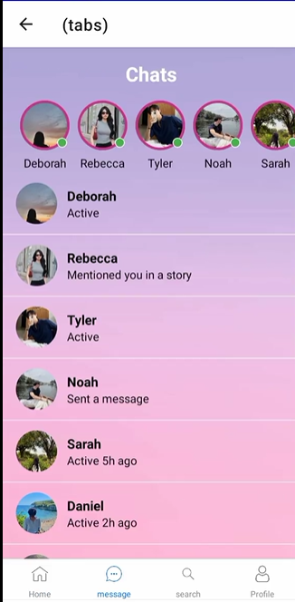
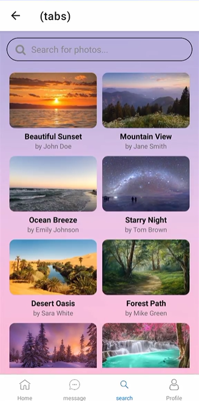
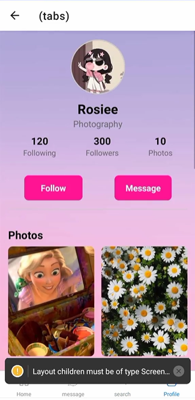

# Photogram
Photogram App.

# Features
* User-Friendly Interface
* Fast Processing
* File Compatibility
* Export Options
* Mobile and Cloud Access

# Course Overview
* Basic React Native Components
* Database Design using Appwrite
* User Registration & Authenticaiton
* Deployment

# Tech Stack
* React Native
* AppWrite
* HTML, CSS and JS

# Home Screen
  

# Sign Up Screen
  

# Sign In Screen
  

# Screen Demo
  
  
  
  
